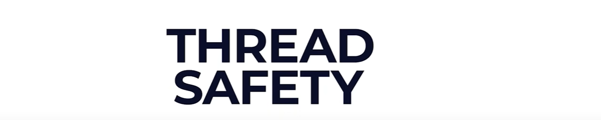

An Object or a code will be called a Thread Safe when he guaranteed that unexpected results won't come and any race-condition
won't occurred or no data corruptions happen, when multiple threads would try to access that object or the block of that code.

