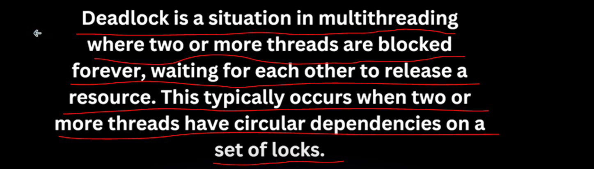
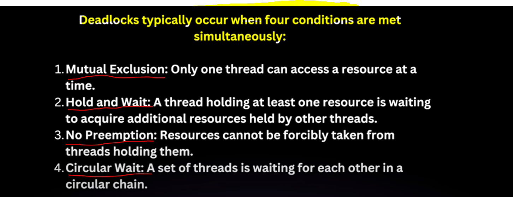
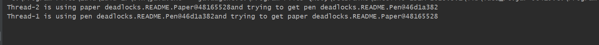

DeadLock Creation
===================

The above one is running Infinitely we need to close forcefully. 

Now condition is - we have 2 threads Thread 1 is having Pen and trying to use paper. Thread2 has Paper and trying to get pen.

so there is no solution so this phenomenon called DeadLock.

Code Explanation
================

-> In pen there is 2 methods and in Paper there is 2 methods. 
-> There is 2 threads Task1 & Task2. now obviously only 1 pen and only 1 paper.
-> Now both the threads is having 2 things pen and paper.
-> Thread 1 is having pen and Thread2 is having paper 
-> In Pen there are 2 methods writeWithPenAndPaper and finishWriting and both are synchronized.
-> In Paper there are 2 methods writeWithPaperAndPen and finishWriting and both are synchronized.
-> Now see Pen is having with Thread1 when any method declared with synchronized keyword which mean this method will
   acquire The intrinsic lock of the object the method belongs to which, mean pen lock's will acquire method- writeWithPenAndPaper.
   and he is calling paper.finishWriting() and paper.finishWriting() is also synchronized and on Paper class which mean Thread1 is having
   pen locks and trying to acquire paper lock....paper lock's will acquire method- writeWithPaperAndPen and he is calling pen.finishWriting() 
   and pen.finishWriting() is also synchronized and on Pen class which mean Thread2 is having  paper locks and trying to acquire 
   pen lock. 
-> which mean both are highly depends on each-other.
-> so nothing is happening and this phenomenon is called DeadLock.

How to Resolve DeadLock
=========================

=> There might be multiple approaches but one common strategy is to Ensure All the Threads would acquire a lock in a consistent order.

=> Which mean The multiple Threads which want to acquire a lock on multiple resource they should have always acquire the resources in 
   the same sequence.

=> Now how they are acquiring the lock if we change that order then deadlock get resolve.
=> Here Task1 getting 1st lock on Pen and then Paper. Task2 getting 1st lock on Paper and then Pen.

Code Explanation
----------------

Here thread1 locks pen and tries to lock paper and thread2 locks paper and tries to lock pen. so here is some problem
they should work in a same order as we want. Now How they are acquiring the lock if we change that then the deadlock should get resolve.

Now Task1 fist need lock on Pen and then on Paper and Task2 first need lock on paper and then on pen. now what we will do for Task2 first
we want lock on pen and then on paper. we will say task2 to first get lock on pen then request for lock paper.

Now It will make sure that Thread 2 lock paper only in the case when he has lock on pen. but pen lock is with thread1 so there will be
no problem and thread 1 will get a lock on paper also because Thread 2 not run. because to run Thread 2 he should have pen lock then only he
can acquire lock on paper.

