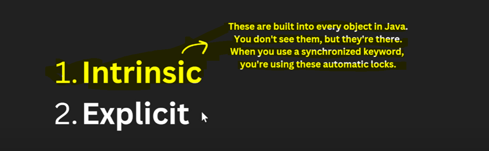
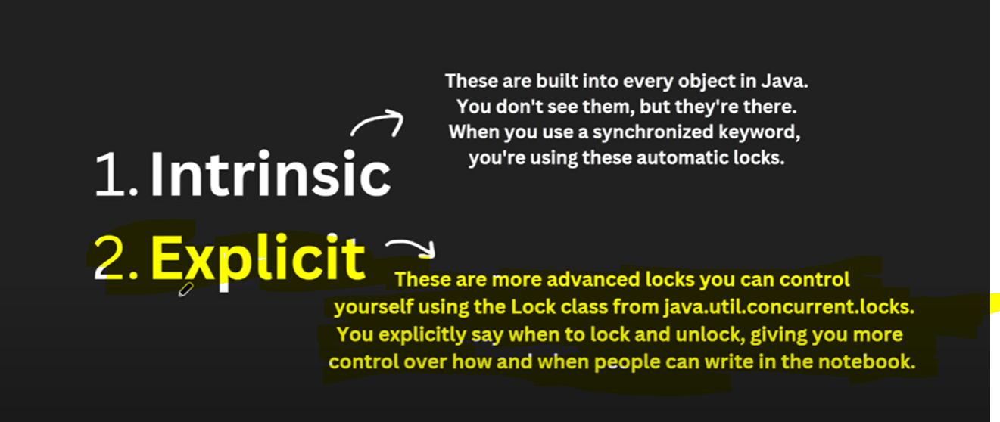

Synchronized Drawbacks
=========================

If we use synchronize then we do not have a control who is doing first and who is doing later who is writing for how much time
we do not have a control on it. But with the help of Lock we can do it like for how much time which thread is going to access
the shared resources.

