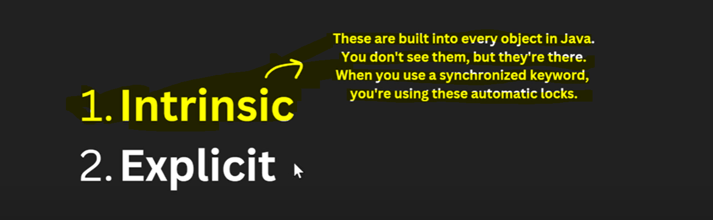
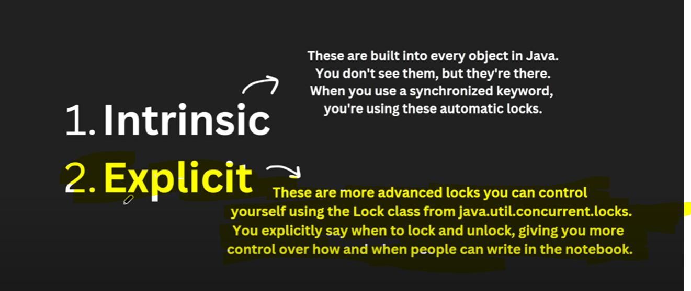

Synchronized Drawbacks
=========================

If we use synchronize then we do not have a control who is doing first and who is doing later who is writing for how much time
we do not have a control on it. But with the help of Lock we can do it like for how much time which thread is going to access
the shared resources.

Drawbacks with Synchronized(Implicit lock) and why Lock(Explicit lock or manual lock) came into picture
==========================================================

when we used synchronized and assume t1 get a lock so t1 got an access for a withdraw. when t1 won't finish the withdrawn process
t2 not going to entered/access it including sleep. we have putted sleep to simulate we are performing some longer operation like
database transaction...

  there might be a chance while t1 performing withdrawn operation it might take longer time than usual or it may possible
  transaction got some error ... which mean in that case t1 won't complete his process and t2 will be in a waiting state 
  for an infinite time... bcz we have not putted anything like timeout scenarios... t2 is going to wait indefinitely thats the problem
  bcz t1 is having lock and t2 is in waiting state this is the problem...

=>  that's the reason we are going to read explicit lock or manual lock i.e LOCK 
     ---------------------------------------------------------------------------

=>  generally In every Object's there is an in build lock available which is synchronized.
    --------------------------------------------------------------------------------------

=> which thread acquired this lock that only can access a critical section.

         Lock lock = new ReentrantLock();          Lock-> interface
                                                   ReentrantLock-> Implementation class

         ->lock.lock() -> which thread execute this statement mean he is trying to acquired the lock. If the lock is not available
                       which mean acquired by some other threads then the thread who execute this statement that will wait then.
         
         ->lock.tryLock()
         

         ->lock.unlock() -> If any thread which acquired the lock and he run this unlock() method which mean he is
                            releasing the lock.  

=> 

