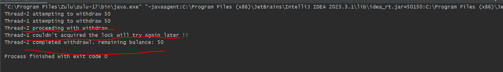
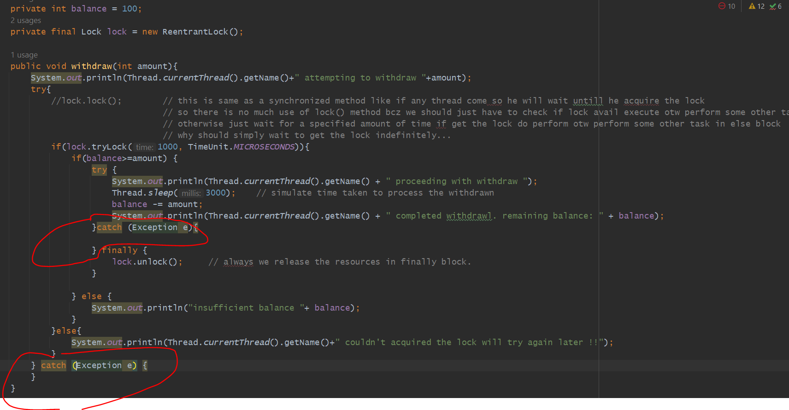
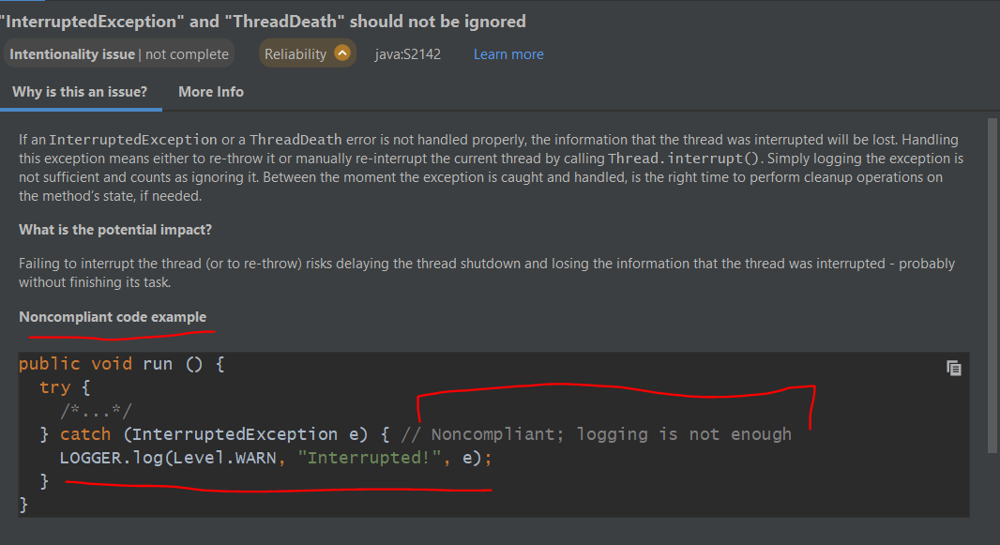
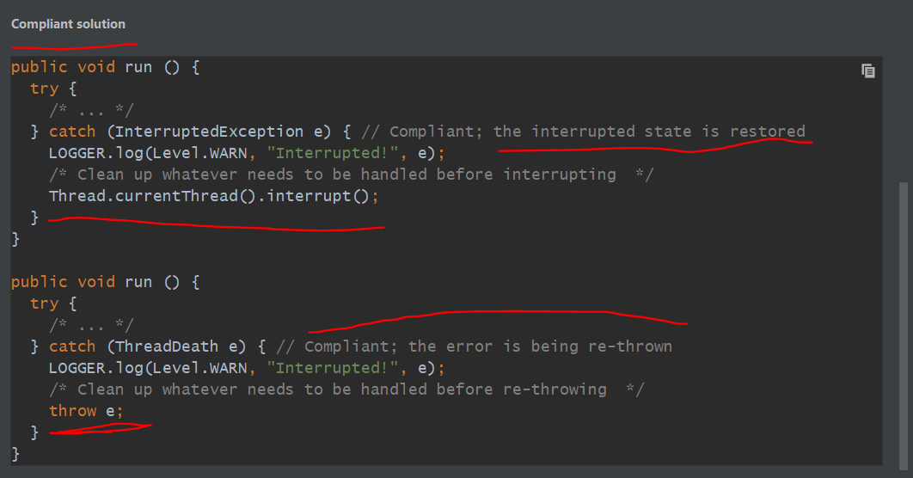
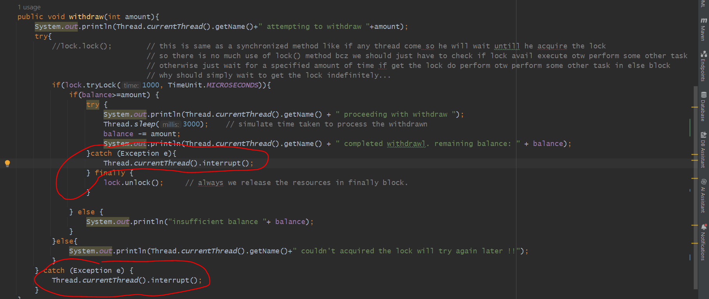
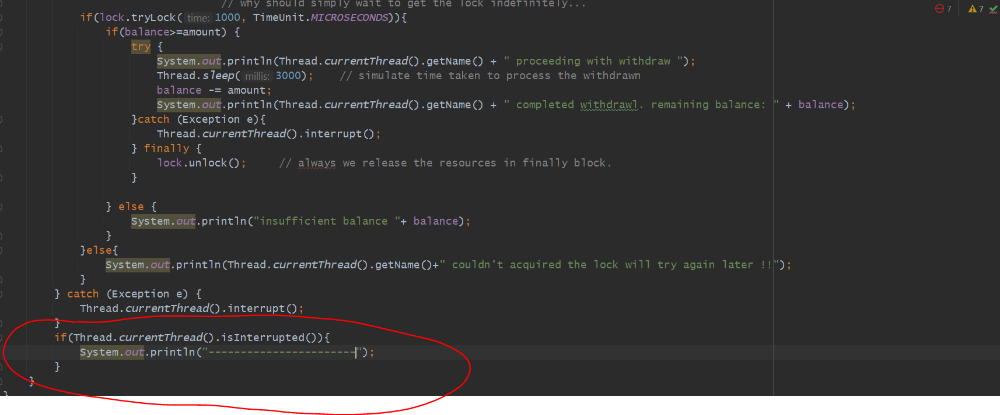

dormant - not active for some time

tryLock() 
---------

Acquires the lock only if it is free at the time of invocation.
Acquires the lock if it is available and returns immediately with the value true. If the lock is not available 
then this method will return immediately with the value false.

tryLock(long time, TimeUnit unit)
---------------------------------

Acquires the lock if it is free within the given waiting time and the current thread has not been interrupted.
If the lock is available this method returns immediately with the value true. If the lock is not available then the 
current thread becomes disabled for thread scheduling purposes and lies dormant until one of three things happens:
The lock is acquired by the current thread; or
Some other thread interrupts the current thread, and interruption of lock acquisition is supported; or
The specified waiting time elapses

lock()
------

Acquires the lock.
If the lock is not available then the current thread becomes disabled for thread scheduling purposes 
and lies dormant until the lock has been acquired.

unlock()
--------

Releases the lock.

analysis
----------

here you can see Thread-1 couldn't acquired the lock will try again later !!

because Thread 1 will wait for 1 second so he won't get the lock so he came in else block

because the reason is Thread 2 is taking 3 seconds to proceed the withdraw process.

here Thread 1 not get a chance to acquire a lock so he not perform withdrawn.

---------------------------------------
step processing...........
---------------------------------------

1. Thread2 come he run tryLock() he got the lock
2. so, Thread2 started processing for 3 seconds...
3. within that time Thread1 also came and trying to get lock, he wait for 1 sec but he didn't get the lock so he not run
4. so for Thread 1 got printed "Thread-1 couldn't acquired the lock will try again later !!"
5. and when Thread2 has been proceed for 3 seconds then balance got deducted.
6. and then Thread2 got completed.

---------------------------------------------------------------
why should not use lock() or why lock.lock() is not much useful
---------------------------------------------------------------
lock.lock();        

 this is same as a synchronized method like if any thread come so he will wait untill he acquire the lock
 so there is no much use of lock() method bcz we should just have to check if lock avail execute otw perform some other task
 otherwise just wait for a specified amount of time if get the lock do perform otw perform some other task in else block
 why should simply wait to get the lock indefinitely...
 

----------------------------------------------------
Important Notes on Exception / InterruptedException
----------------------------------------------------

we kept catch block blank for now. so here sonar lint is telling 
           -> "Either re-interrupt this method or rethrow the "InterruptedException" that can be caught here."

why this is an Issue??
----------------------

If an InterruptedException or a ThreadDeath error occurred and is not handled properly, 
the information that the thread was interrupted will be lost.
Handling this exception means either to re-throw it or 
manually re-interrupt the current thread by calling Thread.interrupt(). 
Simply logging the exception is not sufficient and counts as ignoring it.

What is the potential impact?
-----------------------------

Failing to interrupt the thread (or to re-throw) risks delaying the thread shutdown 
and losing the information that the thread was interrupted - probably without finishing its task.

=> so we are loosing the information here that this thread was interrupted and he has not completed his work completely.

=> SO, If any Monitoring code is there he will get to know that this is the thread who got interrupted in below code we didn't do we just logged it.

=> But In below again we again re-stored their states so that it easy to find out this thread was Interrupted. 
   earlier we just logging so Logging is not enough.

=> you have to store that state which will tell this Thread was interrupted again you have to re-store it
   so that other threads will get to know or If any monitoring tool is running they can found out which thread got interrupted. so its a good practise.

Now after Interrupt if u want to do something
-----------------------------------------------

Now after Interrupt if u want to do something like logging and all you can do like this. But In that case you can't do because
you lost the state of that Thread.

Now In catch block you manually re-stored the state of that thread. that interrupt that thread so that if we want to do any clean up code
or any maintenance code will run.  

