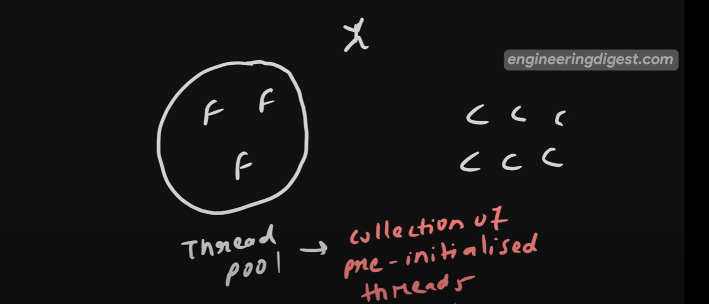

Thread Pool
-----------

Collection of pre-initialized threads that are ready to perform a tasks.

Instead of creating a new Thread to perform a task we will create a pool with some pre-initialized threads.

Why Thread Pool ?
----------------

1. Resource Management
    Creating and destroying a threads for each task can be expensive. 

2. Response Time
    Because of Improper resource management Response time will be increased. bcz you are not going to create a thread it would be already present.

3. Control Over Thread Count
    It will limit on How maximum no. of Threads you can create.  
    

How we can Create a Thread Pool
--------------------------------
-   Executor Framework