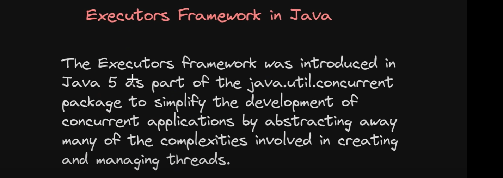
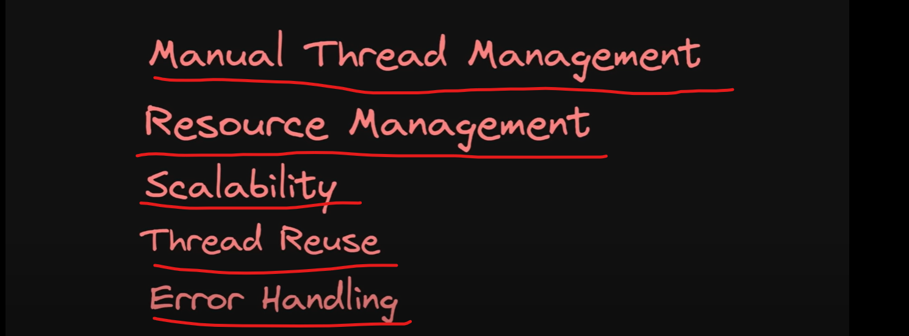
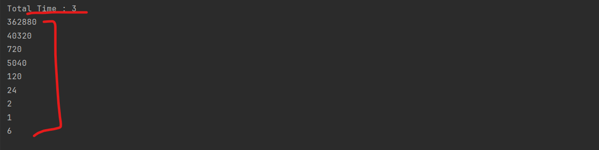
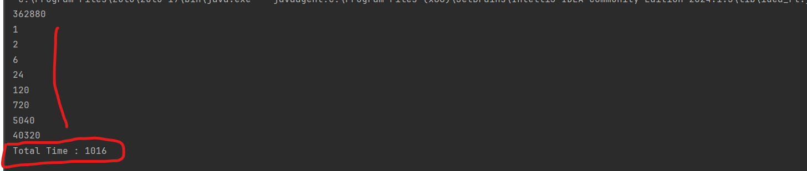

Executor Framework
------------------

You are not going to creating and managing a threads manually Executor Framework will do it.

Problems Prior to Executor Frameworks
-------------------------------------

so if more req. will come in that case system won't work.

and Without Thread Pooling many threads will create and destroyed so there will be some overhead and more memmy and cpu get consumed.

If you manually create a threads might be chance more error to comes.

Executor Framework 3 main component
-----------------------------------

1. Executor

2. ExecutorService

3. ScheduledExecutorService

 

What is the problem with below code
----------------------------------

        /** Let's do In Multithreading environments
         * we are creating 10 threads
         *
         *         since we have a main thread and other threads will run. so here first main thread will print the total time.
         *    we have not wait for all threads to get finished. this time actually showing for creating a threads and all not for execution time.
         *    so, we have to wait for all threads to get finished.
         *
         * => so scenarios may come If you want to perform some task and to perform task you need the results or response of all the threads
         *    might be 9 times you are fetching data from database and you want to use at end all the fetched data then let's see how we can perform.
         * */

        /** Let's do In Multithreading environments
         * we are creating 10 threads
         * */
        long startTime=System.currentTimeMillis();
        for(int i=1;i<10;i++){
            int finalI = i;
            Thread t=new Thread(()->{
                long result = factorial(finalI);
                System.out.println(result);
            });
            t.start();
        }
        System.out.println("Total Time : " + (System.currentTimeMillis()-startTime));

      o/p-

  

Explanation-
        since we have a main thread and other threads will run. so here first main thread will print the total time.
   we have not wait for all threads to get finished. this time actually showing for creating a threads and all not for execution time. 
   so, we have to wait for all threads to get finished.

=> so scenarios may come If you want to perform some task and to perform task you need the results or response of all the threads
   might be 9 times you are fetching data from database and you want to use at end all the fetched data then let's see how we can perform.

Perform task depends on Resulting of all Threads results
--------------------------------------------------------
        /**
         * Perform task depends on Resulting of all Threads results
         * so first all threads should complete and we will use the results from all threads at end to perform something.
         *
         * 1. first of all create an array of threads
         * 2. it will start from 0
         * 3. then you have to wait for all threads to complete
         * 4. now response time will print at end after all threads completes
         */
        long startTime=System.currentTimeMillis();
        Thread[] threads = new Thread[9];
        for(int i=1;i<10;i++){
            int finalI = i;
            threads[i-1] = new Thread(()->{
                long result = factorial(finalI);
                System.out.println(result);
            });
            threads[i-1].start();
        }

        for(Thread thread : threads){
            try {
                thread.join();
            } catch (InterruptedException e){
                Thread.currentThread().interrupt();
            }
        }
        System.out.println("Total Time : " + (System.currentTimeMillis()-startTime));
    }

 

=> without multithreading it was taking 9 sec but now with multi-threading it takes 1 sec.
=> now we are creating 9 threads and doing tasks.

Problems without Executor Framework
===================================

manually we need to create and start the threads and managed the threads.

Now you just write business logic thread related works Executor framework will do.

we were not re-using the threads but in Executor framework we can reuse the threads as well.

